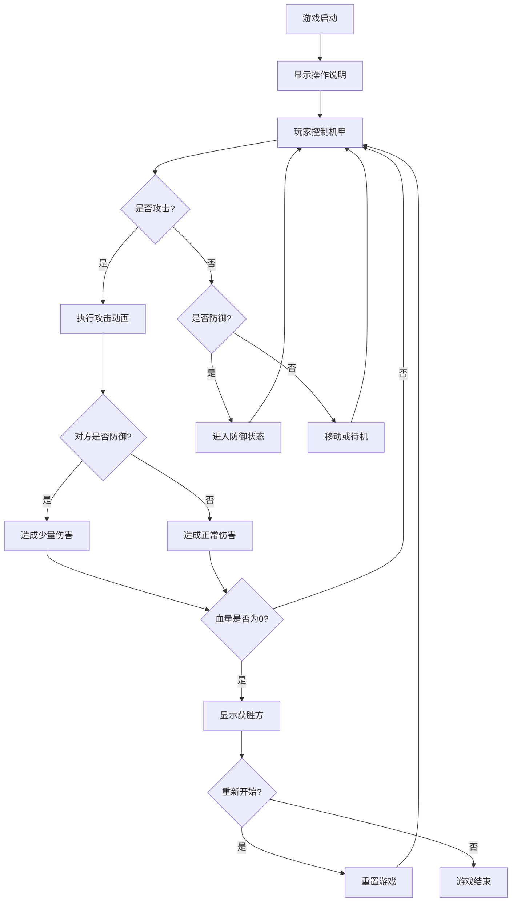

## 1. Product Overview
像素风机甲对战小游戏是一款基于HTML5 Canvas的复古风格2D格斗游戏，支持本地双人对战，包含完整的机甲角色、战斗系统和胜负判定机制。
- 目标用户：休闲游戏玩家，适合朋友间的本地对战
- 产品价值：提供简单有趣的像素风格游戏体验，无需安装即可运行

## 2. Core Features

### 2.1 User Roles
| Role | Registration Method | Core Permissions |
|------|---------------------|------------------|
| Player 1 | Keyboard (WASD) | 控制左侧机甲移动、攻击、防御 |
| Player 2 | Keyboard (方向键) | 控制右侧机甲移动、攻击、防御 |

### 2.2 Feature Module
1. **游戏主界面**: 像素风格的战斗场景、两个机甲角色、UI界面
2. **战斗系统**: 移动控制、攻击机制、防御机制、血量系统
3. **胜负系统**: 血量耗尽判定、游戏结束显示、重新开始功能
4. **角色动画**: 机甲待机、移动、攻击、防御动画效果

### 2.3 Page Details
| Page Name | Module Name | Feature description |
|-----------|-------------|---------------------|
| 游戏主界面 | 战斗场景 | 像素风格背景、地面、天空，营造未来战场氛围 |
| 游戏主界面 | 机甲角色 | 两个可控制的像素机甲，包含身体、武器、护盾等元素 |
| 游戏主界面 | UI系统 | 血量条、角色名称、操作提示、游戏状态显示 |
| 游戏主界面 | 控制说明 | 操作按键提示，让玩家快速上手 |
| 游戏结束 | 胜负显示 | 显示获胜方，提供重新开始选项 |

## 3. Core Process
游戏启动后，玩家看到操作说明，然后可以直接开始对战。两个玩家分别控制各自的机甲，通过移动接近对方，使用攻击造成伤害，或使用防御减少伤害。当一方血量耗尽时，游戏结束并显示获胜方，玩家可以选择重新开始。

## 4. User Interface Design
### 4.1 Design Style
- **Primary colors**: 蓝色 (#00ffcc) 和 红色 (#ff3366)，分别代表两个阵营
- **Secondary colors**: 深灰色 (#1a1a2e) 和 浅灰色 (#16213e)，用于背景和界面元素
- **Button style**: 像素风格按钮，带有边框和点击效果
- **Font**: 使用像素风格字体 (Press Start 2P)，营造复古游戏氛围
- **Layout style**: 固定画布大小，居中布局，UI元素分布在画布顶部和底部
- **Icon style**: 像素风格图标，使用简单几何图形构成

### 4.2 Page Design Overview
| Page Name | Module Name | UI Elements |
|-----------|-------------|-------------|
| 游戏主界面 | 战斗场景 | 像素风格的星空背景、地面网格线，配色为深色系 |
| 游戏主界面 | 机甲角色 | 蓝色机甲（左）和红色机甲（右），包含身体、手臂、武器、腿部等像素元素 |
| 游戏主界面 | 血量条 | 顶部左右两侧分别显示两个机甲的血量，红色填充，白色边框 |
| 游戏主界面 | 操作提示 | 底部显示操作按键说明，白色文字 |
| 游戏结束 | 胜负显示 | 中央显示获胜方文字，带有闪烁动画效果 |

### 4.3 Responsiveness
- 固定画布大小为 960x540 像素，适配大多数屏幕
- 采用居中布局，保持游戏画面在各种设备上居中显示
- 不支持响应式缩放，保持像素风格的原汁原味

### 4.4 素材方案
- **场景素材**: 使用Canvas绘制像素风格背景，包含星星、地面、网格线
- **角色素材**: 使用Canvas绘制像素机甲，通过代码控制不同部位的颜色和动画
- **UI素材**: 使用Canvas绘制血量条、按钮等UI元素
- **音效**: 暂不实现，可后续扩展
